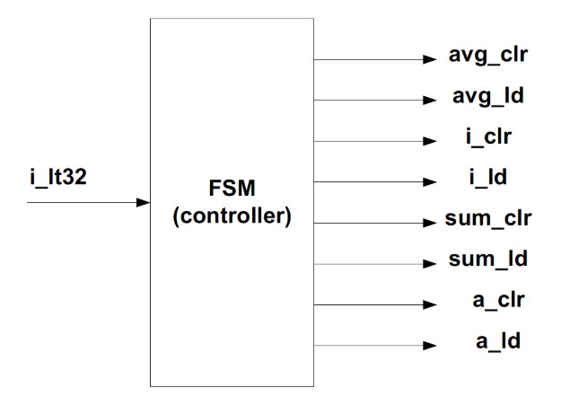
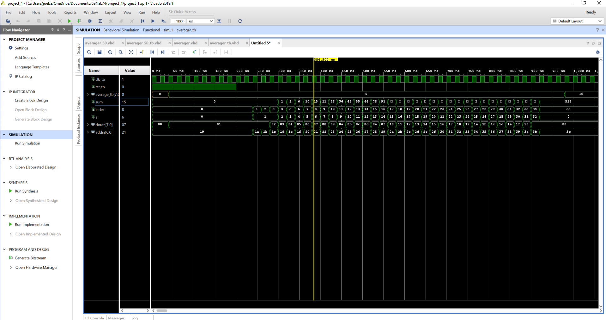

# CSUN ECE 524L Fall 2021
## Lab 4 - Datapath and Control Path

**Report Created by:**
- Group 2 
- Morris Blaustein
- Joseph Barchanowicz
- Karl Garcia

**Submission date:** 10/26/2021

## Introduction
Our goal for this lab is to understand how to apporach a real design problem by decomposing it to datapath and control path. We will also learn how to design control unit using FSM, infer FPGA resources, and synthesize a large design using structural modeling. For this lab, we will be design a circuit that calculates the average value of 32 8-bit numbers of an array M. Figure 4.1 shows a block diagram of the design datapath. 

Figure 4.1: Block Diagram of the Design Datapath

In the design, Array M is stored in block RAM, with the first element at address 25, the second at address 26, and so on. The block RAM for the design can be easily instantiated, but we do need to design the control path using an FSM. The FSM is suppose to generate all necessary control signals that are specificied on the give block diagram (figure 4.1).

## Pre-Lab
**Question 1:** Estimate the FPGA area in terms of LUTs, FFs, memory, etc. for the design shown in Figure 4.1 and elaborate your answer.  

If each LUT is takes 5 inputs then the component i will use 8 LUT's (one for each bit), component sum will use 8, component a will use 8, average will use 8, component average will use 8, then each of the other components will use 1, and 1 BRAM.  This rough estimate of LUTS is 38, I will double this number for flip flops and say that we will use 76 flip flops.  

**Question 2:** Draw the state diagram for FSM. The state machine block diagram is shown in Figure 4.2.  

  
Figure 4.2: FSM block diagram to generate the control signals for the datapath shown in Figure 4.1  

Figure 4.3 shows the State Diagram for the above FSM.

  
Figure 4.3: State Diagram for FSM

## Procedure
**Task 1:** Implement the complete design including datapath and control path. Simulate your design for correct functionality. Include simulation of your design in your final report. Your simulation should clearly show your work and the average calculated by your datapath.  
  
Task 1, we were asked to implement the complete design including datapath and control path. We then needed to simulate the design for the correct functionality.  This is shown in Figure 4.4 located in the "Results (Data) section of this lab report. This figure is showing the correct functionality of the complete design. 

**Questions 3:** What is the FPGA area utilization for your design? How does this compare with your estimation in question 1? Explain your answer.  
  
The FPGA utiliztation of this device is shown in Figure 4.7 and 4.8 located in the "FPGA Resources" section of this lab report.  It shows that the design uses 45 LUT's, and 69 flip flops.  My estimate was slightly off with the number of LUT's and flip flops used, but i think that it is a very close estimate.  The Zybo Z7-10, the FPGA that I use, has 17,600 LUT's, 35,200 flip flops, and 270 KB of BRAM.  

**Task 2:** Modify the design to indicate overflow. Prove that your logic works by including the proper testbench. 

For task two, we converted the averager, which is an integer, to a std_logic_vector with 9 bit width. The most signficant bit indicates whether there is overflow. When 32 numbers are averaged, it is not possible to have overflow. If all 32 bits are the max value 255, sum = (32*255) and average = sum/32. When the average is 255, this fits precisely into an 8 bit standard logic vector. it is only possible to have overflow when more than 32 numbers are averaged, considering the 8 bit width of the average signal The waveform is shown in Figure 4.6, in the "Results (Data)" section of this lab report. 

**Task 3:** Modify your design if there are 50 numbers. How will the block diagram change? You need to add a logic to calculate the average of 50 numbers. Prove that your logic works by including the proper testbench.  
  
Task 3, we were asked to implement the complete design including datapath and control path. We then needed to simulate the design for the correct functionality.  This is shown in Figure 4.5 located in the "Results (Data) section of this lab report. This figure is showing the correct functionality of the complete design. The block diagram will change when you have to average the sum.  In the original block diagram we could shift right the sum by 5, which is the same as dividing by 32.  In the case of averaging 50 we can no longer use the shift method.  The method we chose to use is to divide the sum by 50.  We can see the effect this has on the number of LUT's and flip flops being used (shown in the FPGA resource section), because division uses alot more resources than than shifting.    

## Testing Strategy
Task 2 and 3 ask for us to write a testbench for the two different averagers to prove that our logic works. The two testbenches will be the testing strategy we used to test our logic and the results are shown in the "Results (Data)" section of this lab report in figures 4.4 and 4.5.   

## Results (Data)

Figure 4.4: 32 Averager Waveform

Figure 4.5: 50 Averager Waveform

Figure 4.6: 32 Averager Overflow

## FPGA Resources

Figure 4.7: 32 Averager RTL Schematic

Figure 4.8: 32 Averager RTL Synthesis

Figure 4.9: 32 Averager RTL Implementation

Figure 4.10: 50 Averager RTL Schematic

Figure 4.11: 50 Averager RTL Synthesis

Figure 4.12: 50 Averager RTL Implementation

## Conclusion
Lab 4 helped solidify our understanding of finite state machines and introduced us to data and control paths. In this lab, it seemed redudant to introduce so many control path signals because the averaging function is relatively simple. There is no need for a finite state machine to compute the average of 32 numbers. Instead, one can simply use a for loop. However, creating the data and control paths helped us understand how they can be implemented so we can use them for more intricate problems that would benefit from using them. 

-------------
-------------

# Is assignment ready for review? Yes
