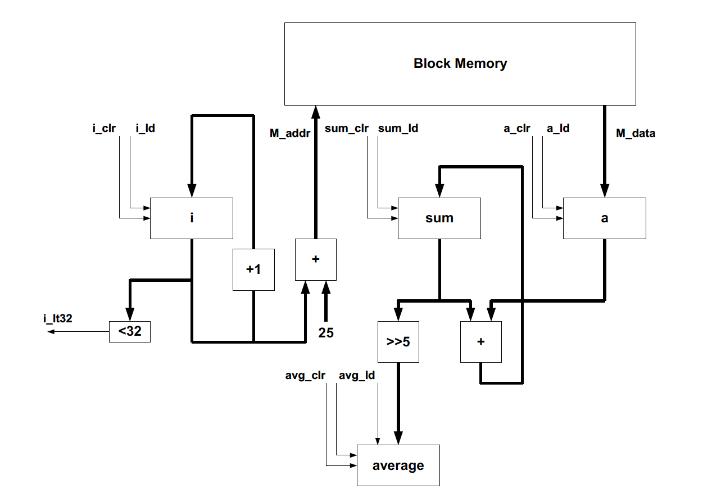

# ECE 524L Fall 2021
**California State University, Northridge**  
**Department of Electrical and Computer Engineering**  

# Lab 4 - Datapath and Control Path

## Objective

After completing this lab, students will be able to:
- Understand how to approach a real design problem by decomposing it to datapath and control path
- Design control unit using FSM
- Infer FPGA resources
- Synthesize a large design using structural modeling

## Requirements

The following material is required to complete the lab:
- Xilinx Vivado 2019.1

## References

- Xilinx FPGA datasheets (available at http://www.xilinx.com)
- Software Manual (available at http://www.support.xilinx.com)

## Introduction

In this lab you are going to design a circuit that calculates the average value of 32 8-bit numbers of an array M. The block diagram of the design datapath is shown in Figure 4.1. Array M is stored in block RAM, with the first element at address 25, the second at address 26, and so on. Block RAM can be easily instantiated or inferred in your design. You need to design the control path using an FSM. The FSM is supposed to generate all necessary control signals that are specified on the given block diagram given in Figure 4.1. 

:question: **Question 1:** Estimate the FPGA area in terms of LUTs, FFs, memory, etc. for the design shown in Figure 4.1 and elaborate your answer.

:question: **Question 2:** Draw the state diagram for FSM. The state machine block diagram is shown in Figure 4.2. 

Figure 4.2. FSM block diagram to generate the control signals for the datapath shown in Figure 4.1

:point_right: **Task 1:** Implement the complete design including datapath and control path. Simulate your design for correct functionality. Include simulation of your design in your final report. Your simulation should clearly show your work and the average calculated by your datapath.

**Note:** The block RAM should be initialized by 32 numbers using COE file. You can load this file when you create Bloack RAM using Xilinx core generator tool. Prepare the initialization file.

**Questions 3:** What is the FPGA area utilization for your design? How does this compare with your estimation in question 1? Explain your answer.

:point_right: **Task 2:** Modify the design to indicate overflow. Prove that your logic works by including the proper testbench. 

:point_right: **Task 3:** Modify your design if there are 50 numbers. How will the block diagram change? You need to add a logic to calculate the average of 50 numbers. Prove that your logic works by including the proper testbench.
